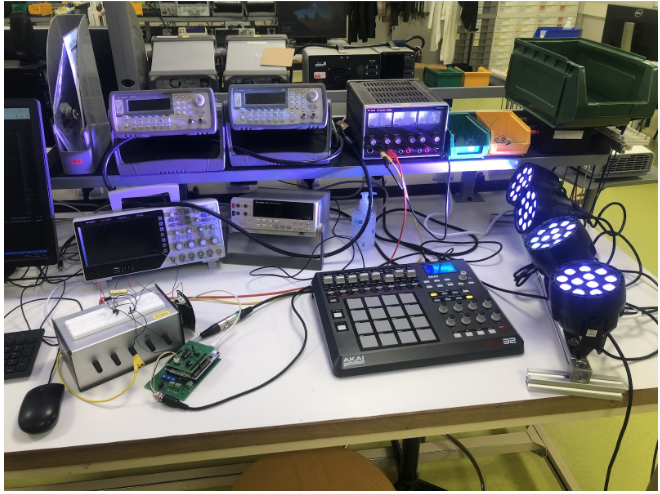
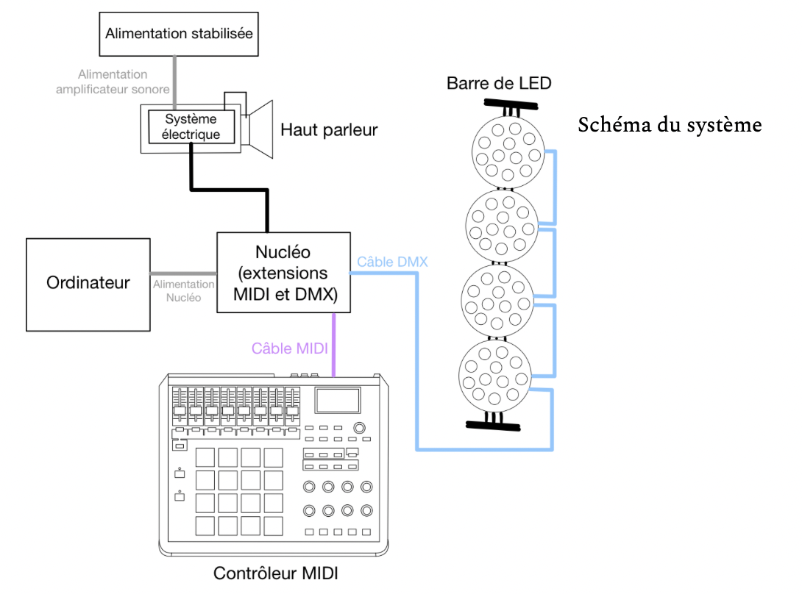

# Sound + Light MIDI Controller

This project is a real-time sound and lighting control system designed for event management. It integrates **DMX** and **MIDI protocols** to synchronize lighting effects with sound systems. The system is built in **C** on an **Mbed OS**-compatible microcontroller (e.g., NUCLEO_L476RG). No external computer is required—everything runs directly from the MIDI controller, making it ideal for live shows or installations like LaserWave.

---

## System Overview and Hardware Setup

  
*Figure 1: Prototype hardware with MIDI pad, microcontroller, DMX and MIDI interfaces.*

  
*Figure 2: High-level data flow from MIDI pads and potentiometers to DMX and audio outputs.*


*Figure 3: Physical connections for DMX drivers, MIDI host, sensors, and power.*

---

## Features

- **DMX Control**: Drive up to four stage projectors with individual color and intensity.  
- **MIDI Mapping**: Map 16 pads across four banks (A–D) to colors, notes, and sequences.  
- **Two Performance Presets**:  
  1. **Direct Mode** – Instant pad-to-light-and-note mapping.  
  2. **Sequence Mode** – Pad triggers a predefined color-melody sequence.  
- **Potentiometer Tuning**:  
  - Global and per-projector LED intensity  
  - Strobe frequency & color  
  - Master audio volume  
- **Sensor Inputs** (optional): Sound level and motion for interactive effects.  
- **Standalone Operation**: No PC needed; all logic on the microcontroller.  
- **Debug & Logging**: Serial monitor output for MIDI commands and state.

---

## MIDI Command Mapping

| MIDI Status | Bank & Action                              | Description                                                                 |
|-------------|--------------------------------------------|-----------------------------------------------------------------------------|
| `0x90`      | Bank A Note On                             | Toggle all 4 projectors to a color and play associated note.               |
| `0x80`      | Bank A Note Off                            | (Ignored) No change on release.                                             |
| `0x91`      | Bank B Note On                             | Light all projectors with a color while the pad is held; play note.        |
| `0x81`      | Bank B Note Off                            | Turn off all projectors and stop note.                                      |
| `0x92`      | Bank C Note On                             | Control each projector independently (Blue/Red/Green/White); play note.    |
| `0x82`      | Bank C Note Off                            | Turn off all individual projectors.                                         |
| `0x93`      | Bank D Note On                             | Independent per-projector colors (Pink/Cyan/Orange/Yellow); play note.     |
| `0x83`      | Bank D Note Off                            | Turn off those specific projectors.                                         |
| `0x94`      | Sequence Mode A (Preset 2 Bank A) Note On  | Execute a predefined group sequence and melody.                             |
| `0x95`      | Sequence Mode B (Preset 2 Bank B) Note On  | Execute a predefined individual-projector sequence.                         |

---

## User Controls & Presets

### Preset 1: Direct Mode

- **Bank A** (Global toggle):  
  - Press to toggle all 4 projectors on/off with one color and play one note.
- **Bank B** (Global hold):  
  - Hold pad to light all projectors; release to turn off and silence.
- **Bank C** (Independent “unary”):  
  - Each of the 4 pads in a column selects Blue, Red, Green, or White for its projector.
- **Bank D** (Independent “warm”):  
  - 4 pads per projector select Pink, Cyan, Orange, or Yellow.

### Preset 2: Sequence Mode

- **Bank A**: Triggers a choreographed sequence across all projectors with a melody.  
- **Bank B**: Triggers per-projector color-melody sequences.  

---

## Potentiometer Functions

| Pot # | Function                                                                                 |
|:-----:|------------------------------------------------------------------------------------------|
| 1     | **Global intensity threshold** – sets minimum LED brightness.                            |
| 2–5   | **Individual projector intensities** – scale above the global threshold.                |
| 6     | **Strobe frequency** – off at 0–20%; proportional above.                                |
| 7     | **Strobe color control** – cycling under 40%; fixed color mapping above.                |
| 8     | **Master audio volume** – controls PWM output on `PB_1`.                                 |

---

## Default State

On boot, the system initializes all projectors to a static **Blue Ocean** color (RGB: 0, 100, 127) at brightness 15.

---

## Application Functionality

In `main()`:

1. **Read Inputs**  
   - MIDI commands via the 5-pin DIN or USB-MIDI host  
   - Potentiometer positions (ADC)  
   - Optional sensors (sound level, motion)  

2. **Process Logic**  
   - Decode MIDI status & velocity  
   - Update DMX frame buffer and PWM audio outputs  

3. **Drive Outputs**  
   - Send DMX frames to projectors over UART-2  
   - Generate audio via `PwmOut(PB_1)` for notes  
   - Log events over serial at 115200 baud

---

## Predefined Sequences

Stored in flash, these sequences specify time-stamped color changes and note events. Trigger with `0x94`/`0x95`.

---

## Debugging & Logging

Connect USB serial (115200 baud) to view:

- Incoming MIDI bytes  
- Active preset & pad states  
- Potentiometer readings  
- DMX frame dumps  

Use any terminal (TeraTerm, `screen`, etc.) to monitor.

---

## Hardware Requirements

- **MCU**: NUCLEO_L476RG (Mbed OS)  
- **DMX Driver**: 4-channel RS-485 transceiver + opto-isolation  
- **MIDI Interface**: 5-pin DIN or USB-MIDI  
- **Sensors** (optional): Microphone module, PIR motion sensor  
- **Power**: 5 V for MCU; 12/24 V for DMX fixtures  

---

## Software Requirements

- **Mbed OS** (≥ 6.0)  
- **Mbed CLI**  
- **Toolchain**: GCC_ARM, ARM, or IAR  

---

## Setup Instructions

1. **Clone** repo  
   ```bash
   git clone <repo-url> && cd sound-light-midi-controller
   ```
2. **Install** Mbed CLI & toolchain  
3. **Wire** per `/docs/amplifier_doc.pdf`  
4. **Build & Flash**  
   ```bash
   mbed compile -m NUCLEO_L476RG -t GCC_ARM --flash
   ```
5. **Power On** and play pads!

---

## Troubleshooting

- **No lights**: Check DMX termination resistor & wiring.  
- **No sound**: Confirm `PwmOut(PB_1)` pin and MIDI note mapping.  
- **Serial logs absent**: Verify USB-serial drivers and baud rate.  

---

## License

Apache 2.0 – contributions welcome!
